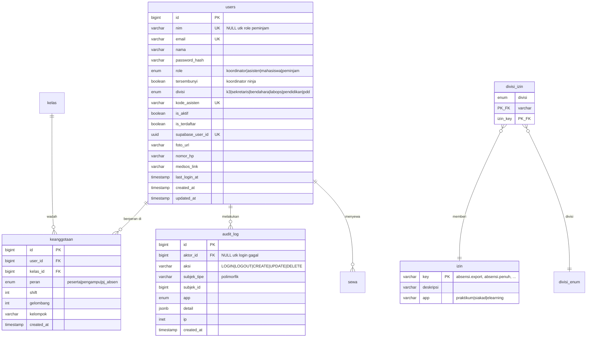
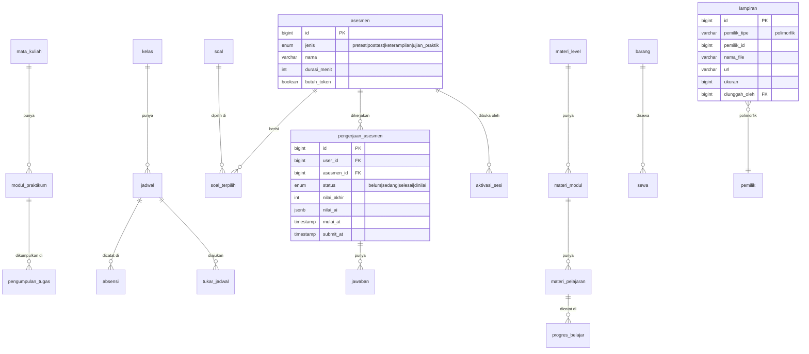

# ERD Gabungan — AlgoHub (1 DB, 1 Auth, 3 Subdomain)

| | |
|---|---|
| **Status** | Rancangan — belum ada SQL dijalankan |
| **Domain** | `algohub.web.id` (praktikum) · `siakad.algohub.web.id` · `elearning.algohub.web.id` |
| **DB** | 1 Supabase Postgres baru (fresh, tanpa migrasi data lama) |
| **Auth** | 1 akun untuk 3 subdomain |
| **Bahasa** | Nama tabel/kolom Bahasa Indonesia (konvensi praktikum) |

---

## 1. Keputusan yang diambil

### 1.1 Role: 4 (dikonfirmasi ketua lab, Sep 2026)

| Role | Gabungan dari | Arti |
|---|---|---|
| `koordinator` | `superadmin`(praktikum) + `koordinator`(siakad) + `kordas` + `admin`(elearning) | ketua/koordinator asisten; termasuk akun teknis (dulu role `admin` elearning) |
| `asisten` | `admin`(praktikum) + `asisten`(siakad) + `asisten`(elearning) | asisten lab; fitur terbuka via divisi |
| `mahasiswa` | `user`(praktikum) + `praktikan` ×2 | mahasiswa/praktikan |
| `peminjam` | `penyewa`(siakad) | orang luar/tanpa NIM — hanya bisa sewa alat |

**Sewa = kapabilitas, bukan role mahasiswa.** Ketua konfirmasi `peminjam` itu role (untuk orang luar). Mahasiswa yang menyewa alat **tetap `mahasiswa`** — semua yang login bisa buka menu sewa; role `peminjam` khusus orang tanpa NIM. Kalau tidak, mahasiswa yang menyewa kehilangan akses praktikum.

**Koordinator tersembunyi (ninja):** kolom `tersembunyi BOOLEAN` di `users`, bukan role ke-5. Alasannya: orangnya sama dengan koordinator, yang beda cuma dia tak muncul di daftar user. Satu flag cukup; role terpisah akan menduplikasi tiap cek izin di 3 app.

### 1.2 Divisi: enum terkunci, 6 nilai

```
k3 · sekretaris · bendahara · labops · pendidikan · pdd
```

Hanya berlaku untuk `asisten` dan `koordinator`. Salah ketik ditolak DB.

### 1.3 Izin: dari tabel, bukan dari nama

Ini memperbaiki bug nyata di siakad. Sekarang di siakad, hak sekretaris/K3 ditulis sebagai **nama** di 4 tempat:

```js
// Absensi.tsx:306 dan :335, KetersediaanAsisten.tsx:25, ManajemenJadwal.tsx:20
user.role === 'koordinator' || ['sekretaris','k3'].includes(user.division?.toLowerCase() || '')
```

Sementara di DB, `sekretaris`/`k3` dicek sebagai **role** yang sudah dilarang constraint (`users_role_check` cuma izinkan `koordinator|asisten|praktikan|penyewa`) — jadi cabang itu mati permanen di 12 file migrasi, termasuk yang terbaru (`20260621151000:55`). UI dan DB tidak sepakat.

Gantinya: izin bernama di tabel `izin_divisi`.

| Lama | Baru |
|---|---|
| `division === 'sekretaris'` | punya izin `absensi.export` |
| `division === 'k3'` | punya izin `absensi.penuh` |
| `assistant_code` diakhiri `'K'` (`Absensi.tsx:336`) | izin eksplisit, bukan sufiks string |

Ganti nama divisi tak lagi mematahkan izin. Sufiks `assistant_code` berhenti jadi sumber izin tersembunyi.

---

## 2. Tabrakan nama tabel — dan satu temuan besar

### 2.1 Fitur asesmen dibuat DUA KALI

Praktikum dan elearning punya mesin asesmen yang **fungsinya sama**:

| Praktikum (Go) | Elearning | Sama? |
|---|---|---|
| `course.jenis`: `pretest` `posttest` `keterampilan` `ujian_praktik` | `assessment_questions.menu_type`: `pre_test` `post_test` `program_keterampilan` `ujian_praktik` | identik |
| `soal`, `soal_terpilih` | `assessment_questions` | sama |
| `pengerjaan_course`, `jawaban_mahasiswa` | `assessment_attempts` | sama |
| `aktivasi_sesi` (token) | `assessment_tokens` | sama |
| AI grading (`pkg/ollama`) | AI grading (`api/grade.ts`, Gemini) | sama |

**Keputusan: satu mesin asesmen, milik praktikum** (dia yang main, sudah teruji, ada `go test` lolos). Elearning berhenti punya tabel asesmen sendiri; dia fokus ke materi belajar (level/modul/pelajaran/progres/game/achievement) dan memanggil asesmen praktikum kalau perlu.

Tanpa ini, satu DB akan punya dua bank soal dan dua tabel nilai untuk ujian yang sama — nilai mahasiswa bisa beda tergantung dibuka dari subdomain mana.

### 2.2 Tabel bertabrakan lain

| Nama bentrok | Asal | Isi sebenarnya | Nama baru |
|---|---|---|---|
| `courses` | siakad | mata kuliah (`code`, `name`, `semester`, `academic_year`) | `mata_kuliah` |
| `course` | praktikum | **asesmen**, bukan mata kuliah | `asesmen` |
| `modules` | siakad | dokumen modul praktikum (`module_number`, `file_url`) | `modul_praktikum` |
| `modules` | elearning | materi belajar (di bawah `levels`, punya `lessons`) | `materi_modul` |
| `submissions` | siakad | upload file tugas + nilai | `pengumpulan_tugas` |
| `audit_logs` ×2 + `activity_logs` | ketiganya | log aktivitas | `audit_log` (satu, polimorfik) |
| `elearning_progress` | siakad (cache) + elearning (sumber) | progres belajar | `progres_belajar` (satu tabel, cache dibuang) |

`elearning_progress` di siakad itu **cache** hasil `POST /api/sync-elearning` — menyalin data lintas DB. Dengan 1 DB, sinkronisasi ini hilang seluruhnya, beserta bug `* 105`-nya (`api/sync-elearning.ts:200`, bikin progres mentok 100% padahal baru 95,3%).

---

## 3. Relasi polimorfik

Tiga tempat, sesuai arahanmu:

**a. `audit_log`** — satu log untuk 3 app, `subjek_tipe` + `subjek_id` menunjuk baris apa pun.

**b. `keanggotaan`** — satu orang bisa punya beberapa peran kontekstual: mahasiswa di kelas A, asisten pengampu kelas B, PJ absen hari tertentu. Tanpa ini, `users.kelas_id` (praktikum) memaksa 1 orang = 1 kelas.

**c. `lampiran`** — file bisa menempel ke `pengumpulan_tugas`, `jawaban_mahasiswa`, `pedoman_laporan`, `modul_praktikum`. Sekarang tiap tabel punya kolom `file_url`/`file_name`/`file_size` sendiri.

---

## 4. ERD — Inti identitas & izin



**Kenapa `nim` nullable:** role `peminjam` (orang luar) tak punya NIM. Unique tetap jalan — Postgres izinkan banyak NULL di kolom unique.

**Login 1 akun 3 subdomain:** cookie sesi di-set pada domain induk `.algohub.web.id`, jadi terbaca ketiga subdomain. Satu `users`, satu `password_hash`, satu penerbit token.

---

## 5. ERD — Domain per app



---

## 6. Auth: arah dibalik

Sekarang **siakad** yang pegang login lalu menerbitkan token untuk elearning:

```
siakad: RPC login_user + kolom password
  └─> RPC get_elearning_handshake_secure → baris di sso_handshakes
       └─> POST /api/generate-jwt → JWT HS256
            └─> window.open(elearning?token=…)
                 └─> elearning /api/verify → resign pakai SUPABASE_JWT_SECRET
```

Praktikum jadi main → praktikum yang menerbitkan. Yang **dibuang**: `login_user`, kolom `password` siakad, `sso_handshakes`, `token_blocklist`, `/api/generate-jwt`, `/api/verify`, `/api/sync-elearning`.

Praktikum sudah siap: `config.go:85` punya `AUTH_MODE` (`legacy|dual|supabase`) + `SUPABASE_JWKS_URL`. Pakai `AUTH_MODE=supabase`, Supabase Auth jadi penerbit tunggal, ketiga app verifikasi JWKS yang sama.

Konsekuensi di siakad: `api/rpc.ts` punya **~150 nama RPC hardcoded** + RBAC di TypeScript (`ROLE_PERMISSIONS`). Daftar itu harus dipetakan ke role baru. Ini pekerjaan terbesar dari seluruh penggabungan — bukan sesuatu yang bisa diselesaikan sambil lalu.

---

## 7. Yang HARUS dihapus sebelum jalan

| File | Alasan |
|---|---|
| `elearning/api/debug-env.ts` | dijaga hanya `?code=faqod123` hardcoded; membalas panjang+preview `SUPABASE_SERVICE_ROLE_KEY`, `JWT_SECRET`, `SUPABASE_JWT_SECRET` + query tabel `users`. **Live di production sekarang.** |
| `siakad` kolom `password` + `login_user` | diganti Supabase Auth |
| `siakad/api/sync-elearning.ts` | tak perlu lagi (1 DB); juga sumber bug `* 105` |

---

## 8. Urutan kerja

1. Buat Supabase baru. Aktifkan Supabase Auth.
2. Migrasi inti identitas: `users`, `asisten_profil`, `izin`, `divisi_izin`, `keanggotaan`, `audit_log`.
3. Seed 6 divisi + daftar izin. Petakan hak sekretaris/K3 lama → izin bernama.
4. Domain praktikum (`asesmen` dst) — sumbernya GORM, `AutoMigrate` dari struct Go.
5. Domain siakad (rename sesuai §2.2). Tulis ulang `ROLE_PERMISSIONS` di `api/rpc.ts`.
6. Domain elearning (materi saja; tabel asesmen dibuang).
7. Cookie domain `.algohub.web.id`. Uji login silang 3 subdomain.
8. Hapus file §7.

**Langkah 4 penting:** praktikum pakai `AutoMigrate` GORM, siakad pakai 60 file SQL migrasi. Dua paradigma di satu DB. Aku sarankan `AutoMigrate` dimatikan di produksi dan semua perubahan skema lewat file SQL bernomor — sama seperti `project_mikon` (Vercel serverless sengaja tak jalankan `AutoMigrate`).

---

## 9. Belum terverifikasi

Butuh data produksi, bukan kode:

1. **Daftar izin sekretaris/K3 sekarang.** Ada di tabel `division_access` prod siakad. Enum divisi sudah pasti (6), tapi *izin apa* yang dipegang masing-masing belum.
2. **Apakah siakad & praktikum pakai Supabase yang sama.** `siakad/api/*.ts` baca `VITE_SUPABASE_URL` dari env Vercel — tak terlihat dari repo. Elearning jelas beda (`tvsawtkevzfqobsfkiag`, hardcoded di `sync-elearning.ts:6`); praktikum `oidwvfcxlxfyojkyurmm`.
3. **Arti sufiks `K` pada `assistant_code`.** Kode memberi hak berbeda (`Absensi.tsx:336`) tapi tak ada dokumentasinya.
